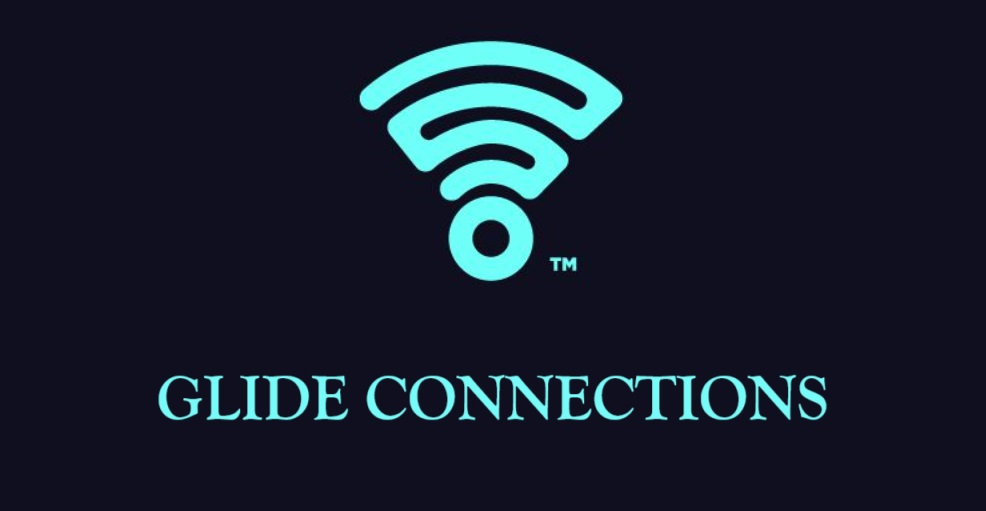

---

---

<h1 style = 'color: #34B3F1' >Contents</h1>

### [1. Introduction](#introduction)

### [2. Context](#context)

### [3. KPIs](#kpis)

### [4. Conclusion](#conclusion)

### [5. References](#references)

# Introduction

Internet has become a key part of our lives since its creation. So much so, that without access to the Internet, you are completely off the grid.  

 
In this project, we play the role of a Data Analyst for the fictional company called  Glide 

# Context

# KPIs

# Conclusion

# References

<a href = #top >Back to the Top</a>
